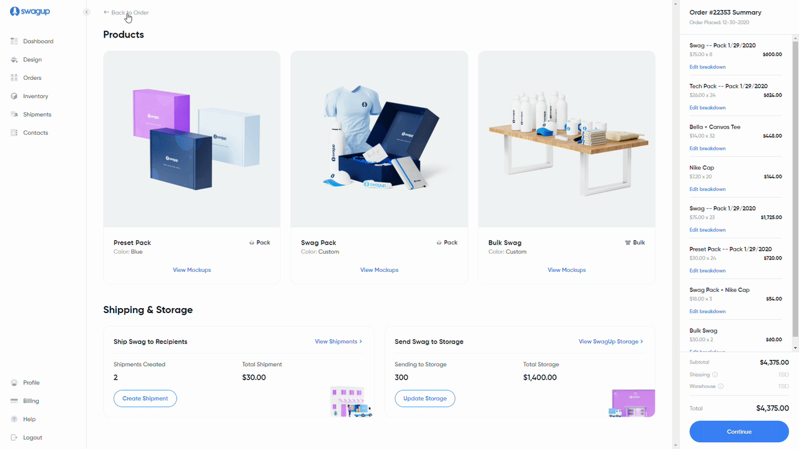

# order-dashboard



> Página de Dashboard de compra mostrando a listagem dos produtos e alguns serviços. Realizado afim de praticar o Tailwind CSS no ReactJs.

## 🚀 Tecnologias

* ReactJs;
* TypeScript;
* Tailwind CSS;
* Vite.

## 💡 Aprendizados

* Prática das classes do Tailwind CSS;
* Instalação do Tailwind CSS no ReactJs e sua configuração;
* Utilização de fontes localmente no Tailwind CSS;
* Uso do Vite para criação de projeto ReactJS;
* Configuração de [plugin](https://www.npmjs.com/package/vite-plugin-svgr) para usar arquivos svg como componente no ReactJs através do Vite;

## 💻 Pré-requisitos

Antes de começar, verifique se você atendeu aos seguintes requisitos:

* Você instalou alguma versão de `Node.js e Yarn/NPM`;

## 🚀 Instalando a página

Para instalar o ignews, siga estas etapas:

yarn:
```
yarn
```

npm:
```
npm install
```

## ☕ Usando a página

Para usar ignews, siga estas etapas:

yarn:
```
yarn dev
```

npm:
```
npm run dev
```

## 🔔 Inspiração

Código realizado a partir dos seguintes conteúdos:

* [Tailwind Collections](https://www.youtube.com/channel/UCgz_8CY-6QVIrVuwA6CpZNA)
* [Design Shojol Islam](https://dribbble.com/shots/17284635-Order-details-page-v2-SwagUp)

[⬆ Voltar ao topo](#order-dashboard)<br>
